# Portfolio

## AIRLINE RESERVATION MANAGEMENT WEBSITE 

### Introduction

Designed and implemented an online flight ticket booking system, reducing system response time by 25% through the use of a microservices architecture with HttpClientFactory for efficient service communication. The system is designed using the MVC pattern and supports operation across multiple local environments.

**Key Components**

- **WebClient (localhost:7000):** Built with Blazor Web, this component handles administrative management and system configuration, providing a robust interface for backend operations.
- **SPAClient (localhost:4200):** Developed with Angular, this single-page application (SPA) facilitates end-user interactions for booking flights, managing tickets, and viewing itineraries.
- **AuthAPI (localhost:7002):** Manages authentication and authorization using JWT tokens to secure access across the system.
- **ScheduleAPI (localhost:7003):** Provides functionalities for managing flight schedules, including availability and timetable management.
- **CouponAPI (localhost:7004):** Handles ticket booking processes and voucher issuance, integrating seamlessly with other system components.
- **ApiGateway (localhost:7005):** Acts as a secure entry point, managing and routing requests to AuthAPI, ScheduleAPI, and CouponAPI to ensure robust security and efficient request handling.
- **Duende IdentityServer6 (localhost:7006):** Implements OpenID Connect (OIDC) for authentication and authorization, enabling secure user access and integration with the WebClient.
- **Unit Testing:** Ensured reliability and code quality with xUnit for backend services and Karma/Jasmine for the Angular SPAClient.

### Technologies Used
- **Front-End:**  Angular 17, ASP.NET Razor, TypeScript, JavaScript, Bootstrap 5, HTML, CSS
- **Back-End:**   .NET/.NET Core Framework 7/8, Code First MVC, Duende IdentityServer6, Microservices, Restful API, JWT,
Entity Framework Core Fluent API, LINQ
- **Unit Testing:**  XUnit, Karma, Jasmine, Postman
- **Database:**   Microsoft SQL Server/Azure Data Studio
- **Documentation:** Produced comprehensive documentation, including ERD, Sequence Diagrams, Activity Diagrams, Use Cases, DFD, BFD,
and Test Cases, ensuring clear communication and project clarity.

### Demo

**SPAClient(Angular)/localhost: 4200**

    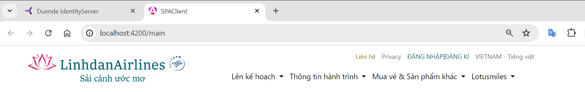

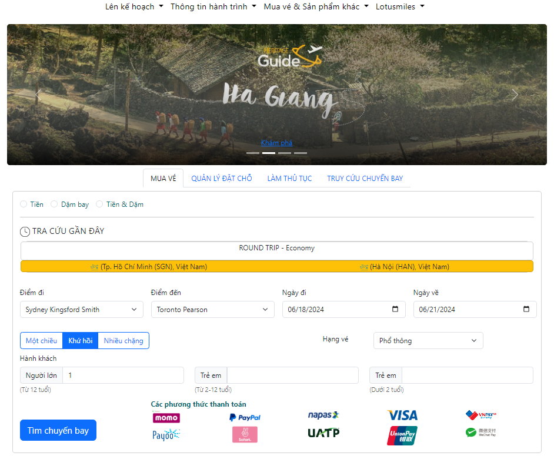

    

    

**WebClient(Blazor Web)/localhost: 7000**

 

    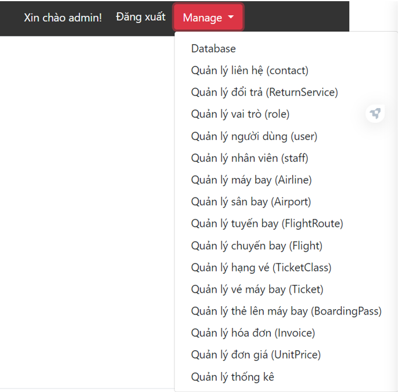

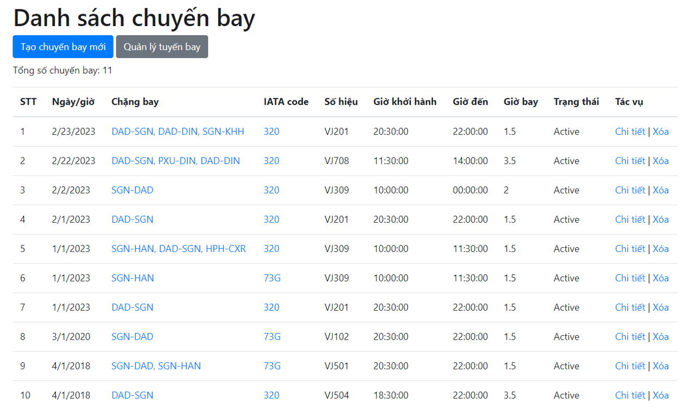

 

**Unit Testing (backend services by XUnit and SPA Angular by Karma/Jasmine/localhost:9876)**

    

        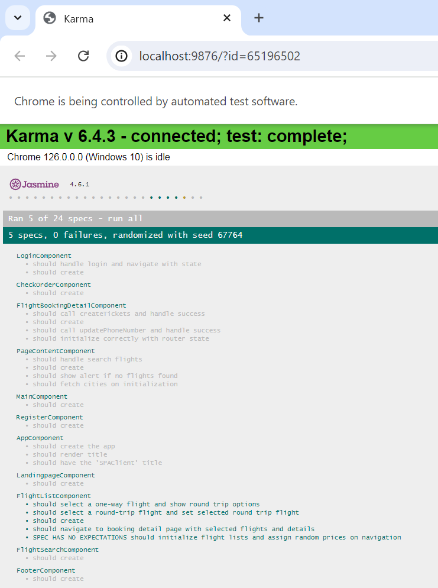
        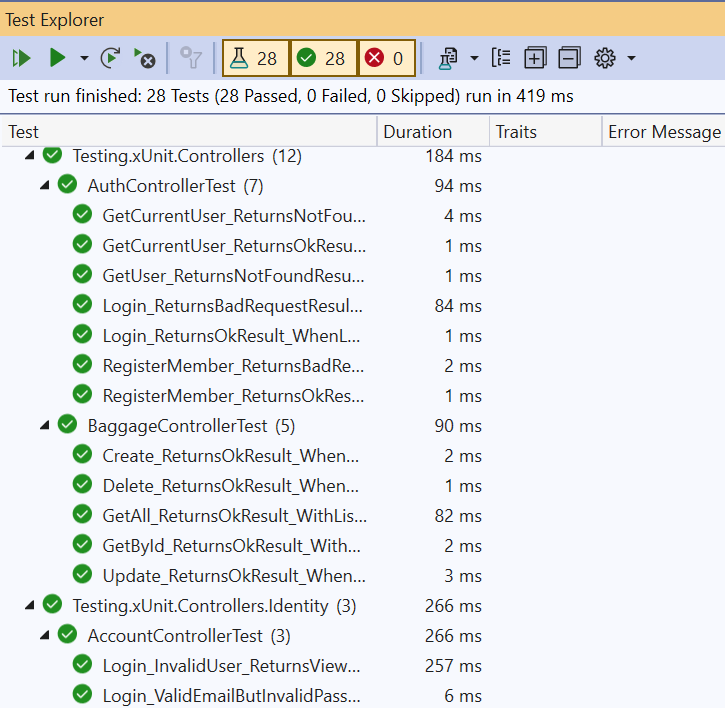
    

    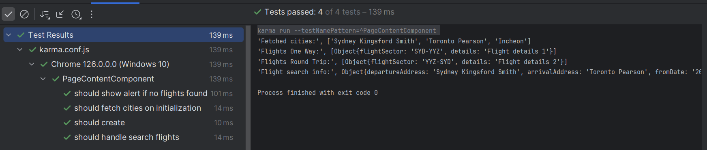

**The document includes diagrams for system analysis**

 

    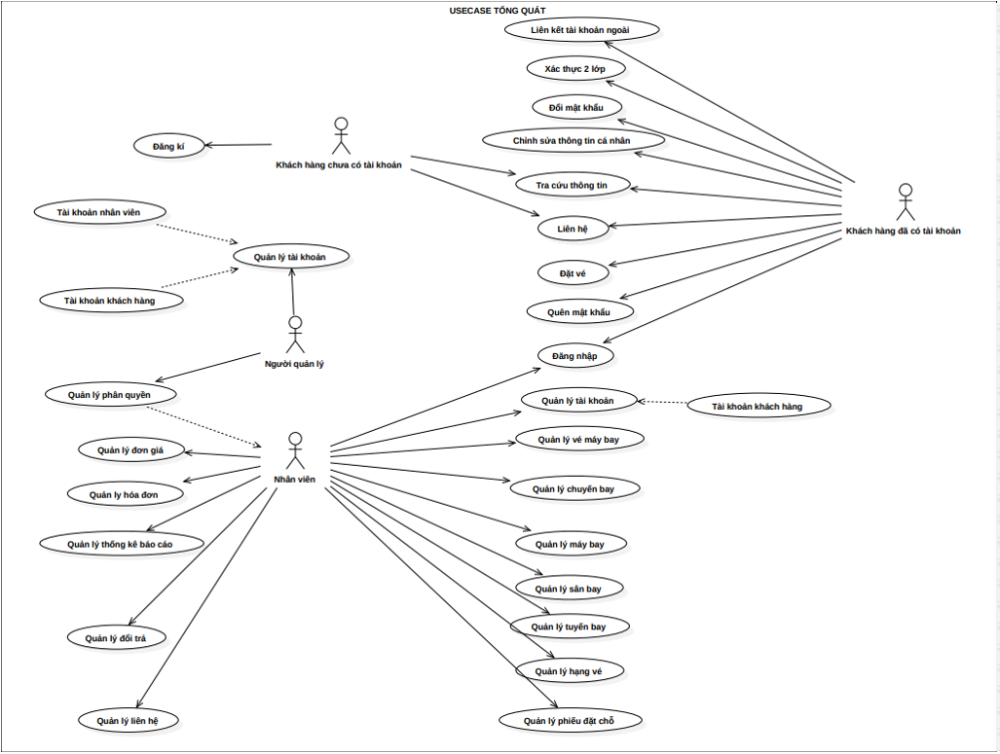
    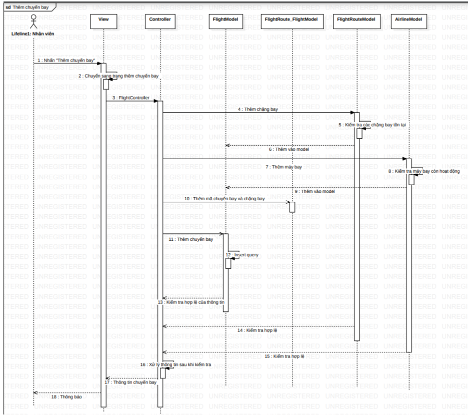

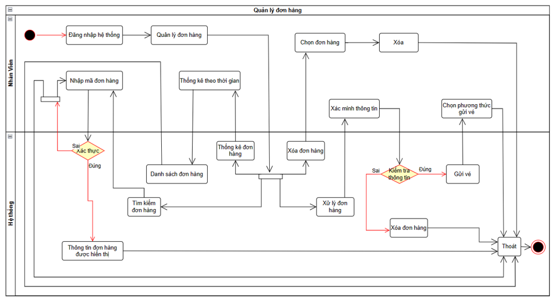

 

---

## ONLINE SHOES SHOPPING SYSTEM 

See website at [***Shoes Website***](https://ld-shoe-php.000webhostapp.com/).

### Introduction

Developed a comprehensive e-commerce platform for online shoe shopping, enhancing the customer experience with a
responsive front-end and robust back-end. Increased user engagement by improving site responsiveness and streamlining the checkout
process in a fast-paced development environment. This system has three modules: Admin, Employee, and Client.

- **Admin:** 
  - Can perform CRUD operations on products.
  - Add new employees.
  - Grant permissions for employees to view/edit/create.

- **Employee:** 
  - Manage orders and product information.

- **Client:**
  - Users can sign up/sign in (via external provider: Google or regular login by authenticating account via Gmail).
  - Shop and store products in the shopping cart even if the website is turned off.
  - View purchase history.

### Technologies Used

- **Front-End:** JavaScript, AJAX, JQuery, Bootstrap 5, HTML, CSS
- **Back-End:** PHP, SQL
- **Database:** MySQL Workbench, PhpmyAdmin
- **Third-Party Integration:**  Twilio SMS, PHPMailer, OAuth 2.0 (Implemented Twilio SMS for customer notifications, PHPMailer for seamless email communication, and OAuth 2.0 for secure user authentication, boosting customer satisfaction by 20%.)

### Demo

    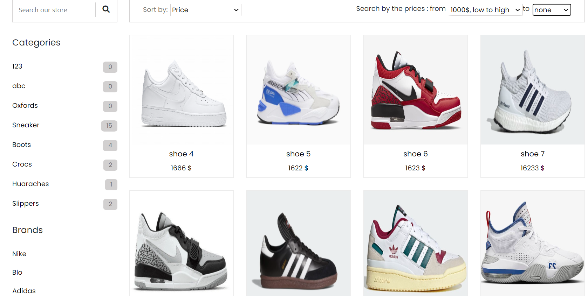

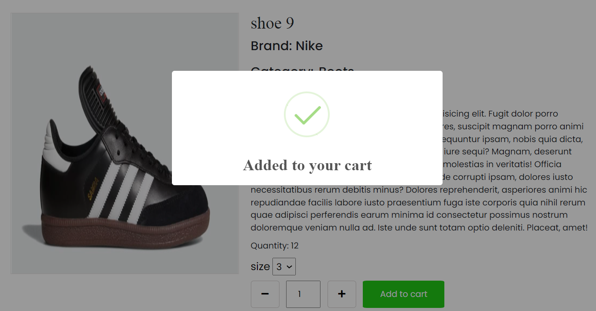

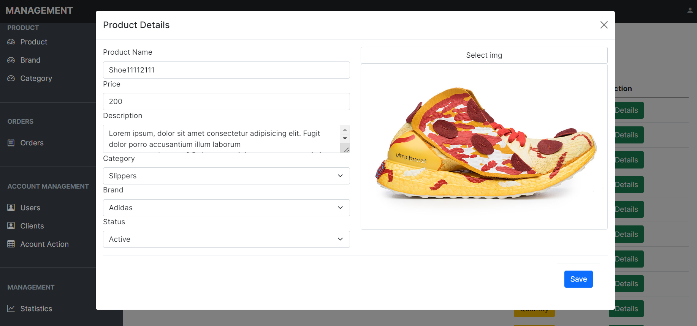

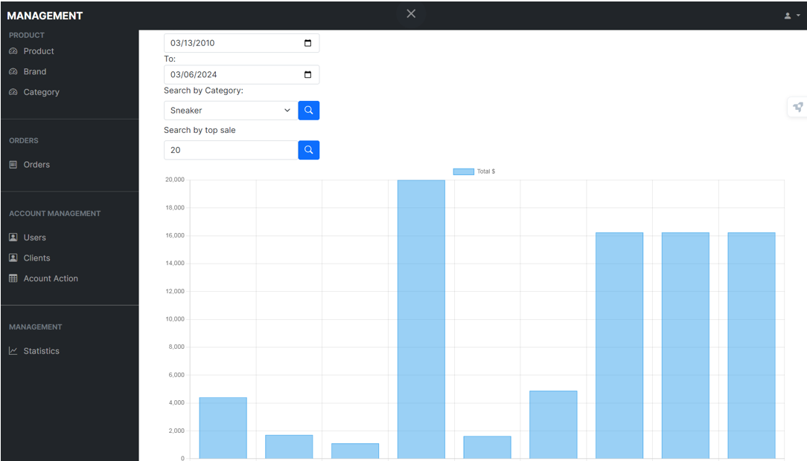

---

## EQUIPMENT LENDING AND MANAGEMENT WEBSITE 

### Introduction

Developed a comprehensive platform for equipment lending and management, increasing user efficiency by 30% by
streamlining the process with a user-friendly interface and robust back-end using Spring MVC and Spring Data JPA.

**Technologies Used:** 

- **Front-End:** Thymeleaf, JavaScript, AJAX, Bootstrap 5, HTML, CSS
- **Back-End:** Spring MVC, Spring Data JPA, Hibernate, MySQL
- **Database:** PhpmyAdmin
- **Additional Details:** : Implemented Hibernate ORM for optimal database management, leveraging MySQL with PhpMyAdmin for seamless data
handling and administration. Applied best practices in design and development to ensure scalability and maintainability.
